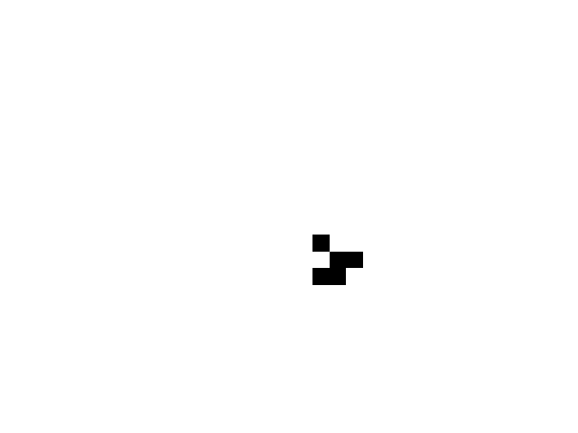
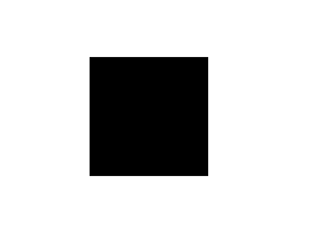
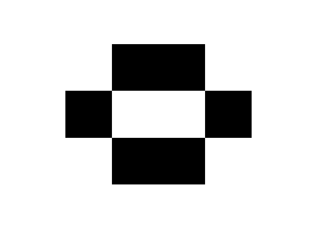
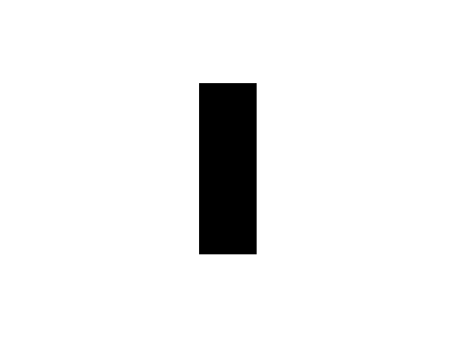
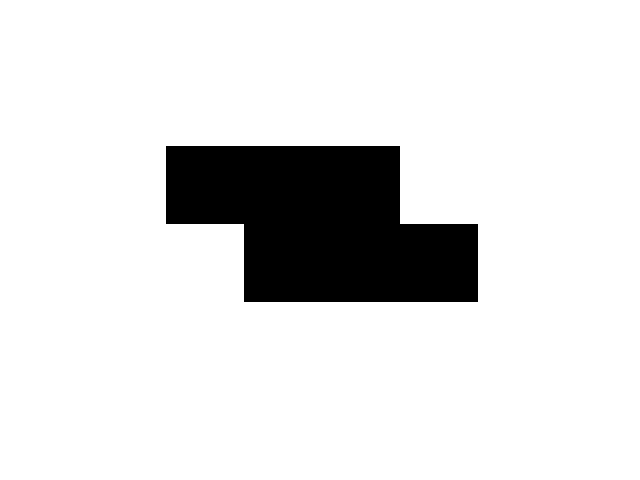
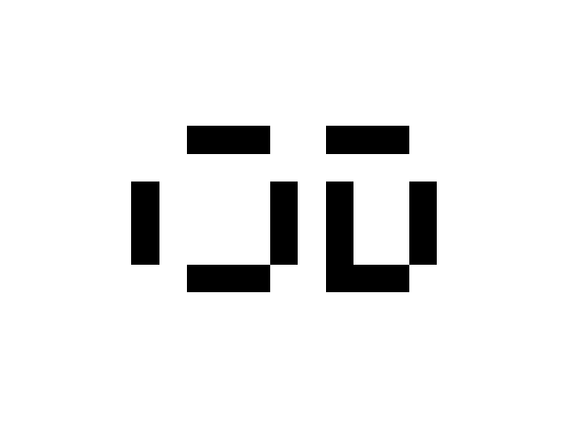
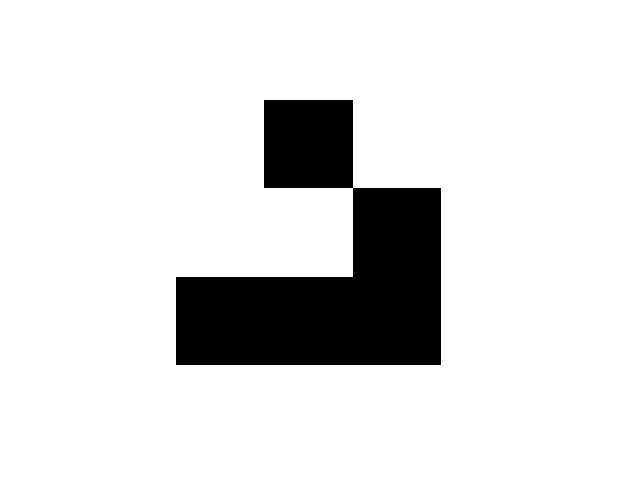
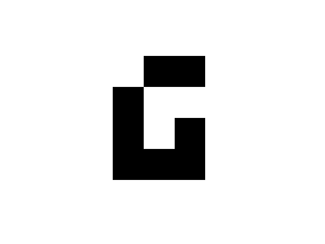
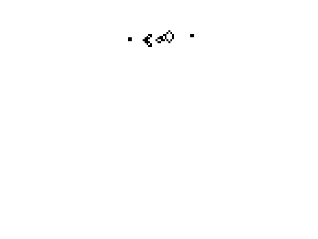
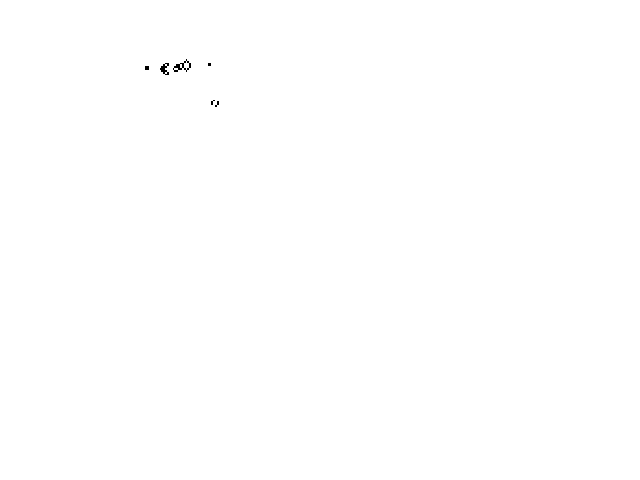

# LifeGame

## 我的科技节作品
<div slign = 'center'>
    
    <p>Logo</p>
</div>

## 🦝 康威生命游戏规则
核心规则（基于细胞周围8个邻居）

| 当前状态|	存活邻居数量|	下一状态|规则说明 |
|--------|-------------|---------|-----------|
| 存活    |	<2	       |死亡|	孤独死亡（Underpopulation）|
| 存活    |	2-3	       |存活 |	稳定存活                |
| 存活    |	>3	        |死亡 |	过度拥挤（Overpopulation）|
| 死亡    |	=3	        |存活  |	繁殖（Reproduction）|
## 🚀 该项目的突破
### 🎮1.**纯Numpy实现**
使用传统的for循环遍历，效率很低下，该项目我致力于提高性能方面。
### 🎨2.**算法创新**
使用数组切片的方法计算邻居,没有使用一个循环

|时间复杂度 |空间复杂度|
|----------|--------|
|$$O(n^2)$$| $$O(n^2)$$ |

## 💻 python 核心代码
1.**计算邻居**
```python
    top         = padded_grid[:-2, 1:-1]  # 上
    bottom      = padded_grid[2:, 1:-1]   # 下
    left        = padded_grid[1:-1, :-2]  # 左
    right       = padded_grid[1:-1, 2:]   # 右
    top_left    = padded_grid[:-2, :-2]   # 左上
    top_right   = padded_grid[:-2, 2:]    # 右上
    bottom_left = padded_grid[2:, :-2]    # 左下
    bottom_right= padded_grid[2:, 2:]     # 右下

    neighbors = top + bottom + left + right + top_left + top_right + bottom_left + bottom_right
```
2.**动态绘出图像**
```python
def animate(frame):
    global grid
    grid = update(grid)  # 更新网格
    img.set_array(grid)  # 更新图像数据
    return img,

ani = FuncAnimation(fig, animate, frames=100, interval=100, blit=True)
```
## 🥊效果展示
我在这里放了一个滑翔机来测试



## 💎康威生命游戏中几个基本模型
### 一、静物（Still Lifes）
稳定不变的结构，不随时间演化改变。


1. 方块（Block）
```python
block = [
    (0,0), (0,1),
    (1,0), (1,1)
]
```
<div slign='center'>
    
</div>

2.蜂巢(beehive)
```python
beehive = [(0,1), (0,2), (1,0), (1,3), (2,1), (2,2)]
```
<div slign='center'>
    
</div>

### 二、振荡器（Oscillators）
周期性循环的结构，周期为2或3代。

1. 眨眼灯（Blinker） - 周期2
```python
blinker = [(0,0), (1,0), (2,0)]  # 垂直方向 ↔ 水平方向交替
```
<div slign='center'>
    
</div>

2. 蟾蜍（Toad） - 周期2
```python
toad = [
    (1,0), (1,1), (1,2),
    (2,1), (2,2), (2,3)
]
```
<div slign='center'>
    
</div>

3. 脉冲星（Pulsar） - 周期3
```python
pulsar = [
    (2,0), (3,0), (4,0),
    (0,2), (0,3), (0,4),
    (5,2), (5,3), (5,4),
    (2,5), (3,5), (4,5),
    # 对称部分
    (0,7), (0,8), (0,9),
    (2,7), (3,7), (4,7),
    (5,7), (5,8), (5,9),
    (2,10), (3,10), (4,10)
]
```
<div slign='center'>
    
</div>

三、太空船（Spaceships）
可移动的结构，在网格中平移。

1. 滑翔机（Glider） - 每4代向右下移动1格
```python
glider = [
    (0,1),
    (1,2),
    (2,0), (2,1), (2,2)
]
```
<div slign='center'>
    
</div>

2. LWSS（轻型飞船） - 每4代向右移动2格
```python
lwss = [
    (0,1), (0,2),
    (1,0),
    (2,0), (2,2),
    (3,0), (3,1), (3,2)
]
```
<div slign='center'>
    
</div>

四、特殊结构
1. 高斯帕滑翔机枪（Gosper Glider Gun）
生成无限滑翔机的复杂结构，需更大空间：
```python
glider_gun = [
     (5, 1), (5, 2), (6, 1), (6, 2),  # 左方方块
        (5, 11), (6, 11), (7, 11),       # 左方竖线
        (4, 12), (8, 12),                # 左方竖线两侧
        (3, 13), (9, 13),                # 左方竖线两侧
        (3, 14), (9, 14),                # 左方竖线两侧
        (6, 15),                         # 左方竖线中间
        (4, 16), (8, 16),                # 左方竖线两侧
        (5, 17), (6, 17), (7, 17),       # 左方竖线
        (6, 18),                         # 左方竖线中间
        (3, 21), (4, 21), (5, 21),       # 中间方块左侧
        (3, 22), (4, 22), (5, 22),       # 中间方块右侧
        (2, 23), (6, 23),                # 中间方块两侧
        (1, 25), (2, 25), (6, 25), (7, 25),  # 中间方块两侧
        (3, 35), (4, 35), (3, 36), (4, 36)   # 右方方块
]
```



## 🧪分析
既然已经有高斯枪的存在，就可以发送信号了，就像神经元一样.
就连生命游戏这么简单的规则下，都能产生这种智慧，那我们人类大脑🧠的存在也不是很稀奇了！

### 🛠️辅助函数
在这里我又写了一个辅助函数add_pattern()用来添加模型
```python
def insert_pattern(grid, pattern_name, position):
    """
    在指定位置插入图形（先清理该区域）
    
    参数:
        grid (numpy.ndarray): 生命游戏网格
        pattern_name (str): 预定义图形名称
        position (tuple): 插入位置的左上角坐标 (x,y)
    
    返回:
        numpy.ndarray: 修改后的网格
    
    异常:
        ValueError: 图形不存在或越界
    """
    # 检查图形是否存在
    if pattern_name not in PATTERNS:
        raise ValueError(f"未知图形 '{pattern_name}'，可选图形：{list(PATTERNS.keys())}")
    
    # 获取图形坐标
    pattern = PATTERNS[pattern_name]
    
    # 计算图形覆盖区域尺寸
    max_x = max(dx for dx, dy in pattern)
    max_y = max(dy for dx, dy in pattern)
    width = max_x + 1
    height = max_y + 1
    
    # 解析插入位置
    x0, y0 = position
    x1 = x0 + max_x
    y1 = y0 + max_y
    
    # 检查边界
    grid_h, grid_w = grid.shape
    if x0 < 0 or y0 < 0 or x1 >= grid_h or y1 >= grid_w:
        raise ValueError(f"插入区域 [{x0}:{x1}, {y0}:{y1}] 超出网格范围 {grid.shape}")
    
    # 清理目标区域
    grid[x0:x1+1, y0:y1+1] = 0
    
    # 插入图形
    for dx, dy in pattern:
        x = x0 + dx
        y = y0 + dy
        grid[x, y] = 1
    
    return grid

```

## 😀经验分享
高斯枪和“block”，“beehive”，“toad”对撞会清除它们





